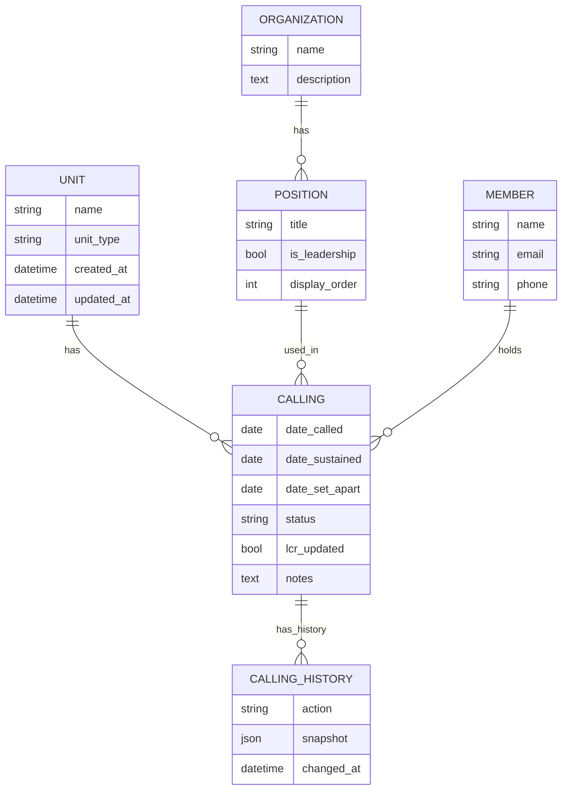

# CallingTrack - Project Plan

## Overview
This Django application is designed to track callings and releases within church units (wards, branches, stake) based on data from a CSV file.

## Current Status (as of 2025-07-08)

### Completed Tasks
- [x] Project setup and configuration
- [x] Django models created for:
  - Unit (Wards, Branches, Stake)
  - Organization (Relief Society, Primary, etc.)
  - Position (specific callings)
  - Member
  - Calling
  - CallingHistory
- [x] Admin interface configured
- [x] Superuser account created

### Next Steps
- [ ] Import data from CSV file
- [ ] Create views and templates for the application
- [ ] Implement user authentication and authorization
- [ ] Add reporting functionality
- [ ] Set up automated backups

## Data Model


## Project Structure
```
CallingTrack/
├── callings/               # Main app
│   ├── migrations/         # Database migrations
│   ├── admin.py           # Admin interface config
│   ├── models.py          # Data models
│   └── ...
├── callingtrack/          # Project settings
│   ├── settings.py
│   ├── urls.py
│   └── ...
├── venv/                  # Virtual environment
├── db.sqlite3             # Database file
└── manage.py              # Django management script
```

## Setup Instructions
1. Activate virtual environment:
   ```
   .\venv\Scripts\activate  # Windows
   source venv/bin/activate  # Mac/Linux
   ```

2. Install requirements:
   ```
   pip install -r requirements.txt
   ```

3. Run migrations:
   ```
   python manage.py migrate
   ```

4. Create superuser:
   ```
   python manage.py createsuperuser
   ```

5. Run development server:
   ```
   python manage.py runserver
   ```

## Notes
- The application is currently in development
- Database is SQLite for development (will need to be configured for production)
- Admin interface is available at /admin/
- Superuser credentials are stored securely (not in this file)

## Future Enhancements
- Add unit tests
- Implement REST API
- Add data export functionality
- Set up CI/CD pipeline
- Add documentation
